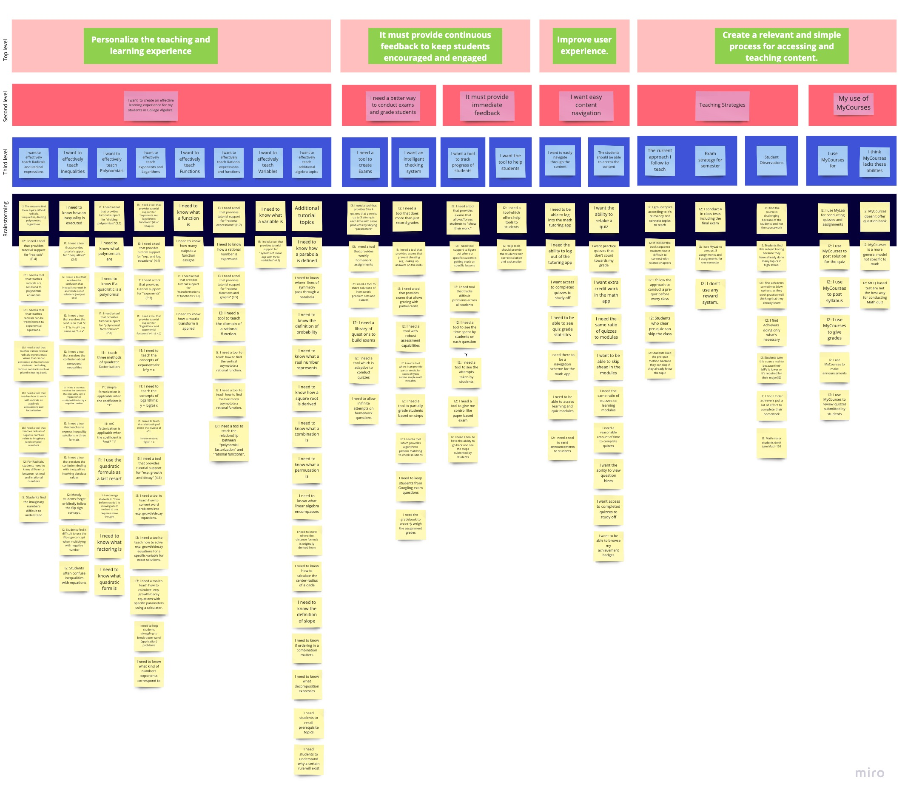

# CATA: Contextual Inquiry

This page details the contextual inquiry for the CATA project.

## Interviews

We started with finding tutors teaching Math-101 in Rochester Institute of Technology. Initially, it was difficult to get in touch and schedule an appointment with professors considering the short span of time we had. Luckily after Michael’s help, we were able to connect with professor Tsukernik who helped us connect with other college Algebra professors.

We interviewed three professors. We used the Think Aloud research method for our interviews.
We interviewed professors in groups of two so that one person can focus on asking questions and one can take notes. We attempted to reschedule with Michelle but her schedule wasn't conducive to quick turn-around.
We also reached out to a student tutor but he never returned our emails.

### Interview Script

This was the interview script we used - 

#### Background (5-10 min)
We are prototyping a new web application that will provide tutoring and quizzing on several critical lessons in MATH-101 College Algebra.  This is for a UX design class.  We will only be designing four to six specific lessons.  These interviews will define the “what” of the lessons in this tutorial application; plus some discussion of administration using an LMS.

We will start by identifying particularly challenging lessons; a small but representative set of lessons is all we need to prototype for our class assignment.

Based on the information you give us, we can develop tutorial content that fits the way people actually learn.

We’d like to audio record the sessions—we don’t have to, if you object. It just gives us a backup to our handwritten notes.

#### About the Students (5-10 min)
Ideally we would have interviewed students but that wasn’t feasible in the time frame of this assignment, so we’d like to ask you a few questions about the range of students who take MATH-101.

Because they would be the primary user of our fictitious webapp, we need to build personas of them.  Don’t name anyone but if you can think of a specific person that would be ideal.  Think of two distinct individuals: one that excelled and one that struggled.

* Where is this person from?
* Why are they taking MATH-101?
* What are their academic or career goals?
* A few personality questions:
  * Introvert or extrovert
  * Active or passive
  * Analytical or creative
* How comfortable are they with MyCourses?  (tech savvy in general?)
* What are their frustrations?
  * about the lessons
  * using MyCourses

#### Pick 5 Interesting Lessons (20-30 min)
Now to the heart of the project; please pick up to five specific lessons in MATH-101 that are challenging or complex.  Give them a few minutes to think about it, leaf through the book, whatever but end with a list before asking the detailed questions.

And then for each lesson ask these questions:

* Give me a quick overview of the lesson?
* Is there a procedural element to this topic?
  * Which steps cause the most problem for students?
  * Can you tell me about a time when a small hint was able to provide the student with an aha! moment when they were previously stuck?
  * What novel (alternative) teaching techniques could you apply to these problematic steps?
* Can you relate the topic/problem to other topics?
(ie, take advantage of the student’s existing cognitive scaffolding)
* What examples best demonstrate the technique?
(especially if it helps explain a difficult steps in the solution)
  * Are there exceptional cases?
  * What specific algebra problems are good assessment candidates?  Why?
  
For the last two questions the instructor can just point out samples from the textbook.

#### About your use of MyCourses (~10 min)
In the last section of the interview we’d like to discuss how you use MyCourses

* How do you use MyCourses?
* Can we get access to the MyCourses shell?
* What are the major pain points while using MyCourses?
* Do you use MyCourses to deliver content?  
(or is the lecture the only content delivery technique?)
* Do you use MyCourses for quizzes or exams?  
* What are the limitations?
* How important is it that students “show their work” on quizzes/exams?
* Does MyCourses have facilities to capture this type of answer content?
* Generally, do you find a lot of students needing help using MyCourses, especially early on?
* What do they struggle with the most?
* Can you tell me about a time when you used a web app for class that helped you to grasp/communicate a difficult topic?
* Can you describe to me how you currently keep track of which topics students tend to need the most help with?
  * Do you find that there are typically large variations of student skills for each topic?
* What is the typical turnover time for students to receive their grades on an assignment?
* Do you incentivize your students?  Do you use any sort of reward system?  Do you feel that gamification of our proposed tutorial app would be useful?
* Do you ever split students into groups through MyCourses? If so, how do you balance the talent? Is it purely random?
* What is your protocol for dealing with students who struggle with the material?
* Do you ever allow open-book quizzes or exams?
* How often do you quiz your students?

## Interpretation Sessions
After the interviews we all met together to discuss our interviews and finalized to use Miro for our Affinity Diagramming. We then discussed our affinity diagram on google hangouts. We wrote all the interview notes in the post-it notes as first person. We also mentioned the interview number (I1,I2,I3) on the post-it note to indicate the interview post-it note belongs to. We then grouped together similar labels and made our way to the top labels.

| Interviewee | Number |
| :--- | --- |
Natalia Fedysiv | I1
Justyna Oldziej | I2
Olga Tsukernik | I3

## Affinity Diagram

Initially, it was difficult to understand how these bottom level interview notes will make sense but as we kept on building the diagram we were able to finalize the important features to focus on and decided on the lessons that can be used for our prototype.

Here is a screenshot of the diagram:

For an interactive view see the [miro board](https://miro.com/app/board/o9J_kvMAaqU=/)
