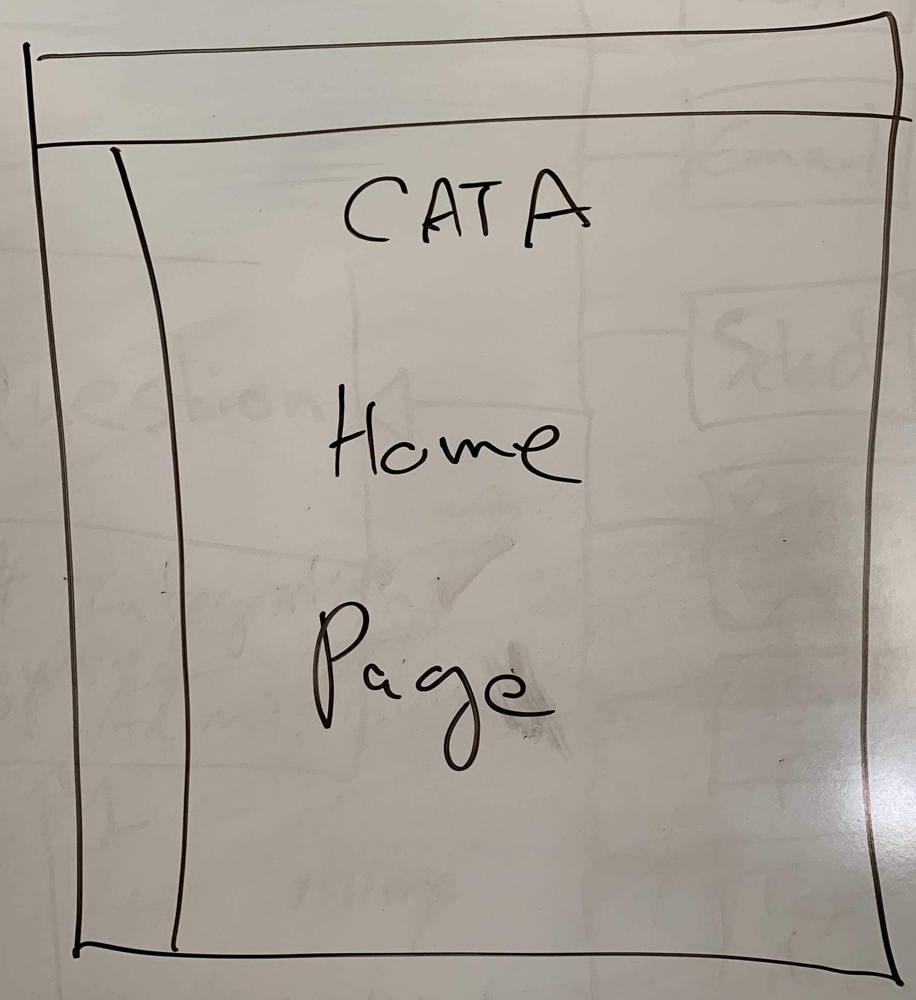

# CATA: Lo-Fi Prototypes

This page provides a set of lo-fidelity prototypes for the College Algebra Tutorial App (CATA) project.
These are organized by three general use cases.

## UC1: _ Student Views Grades _

The students logs into the Tutorial App (login page not shown) and the students starts at the App's
Global Home page.

The student selects the _College Algebra_ class and the system navigates to the Class Home page.

Here the student can find his score on the latest quizzes graded.  She was excited to see she had won
a badge for this quiz and she is now on the leaderboard.

## UC2: _ Student Takes a Lesson _

The 

## UC3: _ Student Takes a Quiz _

The 

