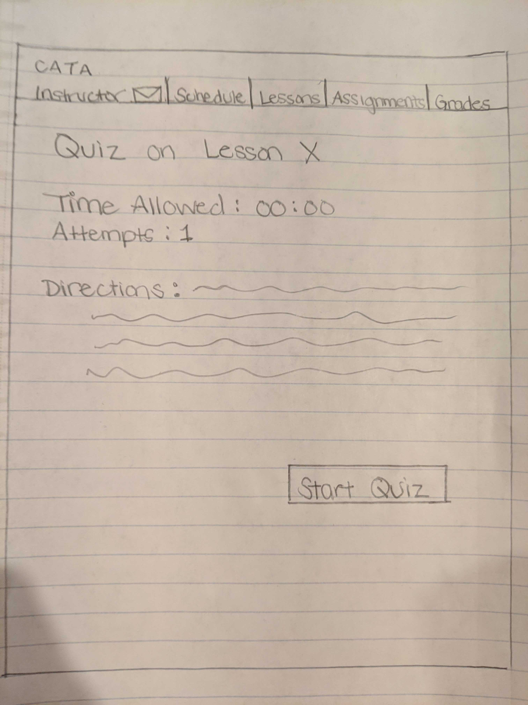

# CATA: Lo-Fi Prototypes

This page provides a set of lo-fidelity prototypes for the College Algebra Tutorial App (CATA) project.
These are organized by three general use cases.

## Notes about our Process

The team spent a few days analyzing both the Affinity diagram and our Project scope proposal to determine
the set of web site pages required to satisfy all of the requirements from these two sources.  When then created
a web site map (see next section) that documents these decisions.  Due to time constraints we decided to focus on
the student experience and tabled all of the instructor pages.

Once we had a set of pages we put up a list on Slack and we negotiated assignments.  We worked independently, due
to covid-19 concerns, and used Slack to share initial sketches.  We then discussed these and members provided feedback
for improvement.  We did two or three iterations until we had a good working set.  We then crafted this web page to
document our designs, organized by use cases.

## Web Site Map

## UC1: _Student Views Grades_

The students logs into the Tutorial App (login page not shown) and the students starts at the App's
Global Home page.

The student selects the _College Algebra_ class and the system navigates to the Class Home page.

Here the student can find his score on the latest quizzes graded.  She was excited to see she had won
a badge for this quiz and she is now on the leaderboard.

To view her history of grades she navigates to her private Profile page.

This page provides additional details and a chart of her progress.

## UC2: _Student Takes a Lesson_

The 

## UC3: _Student Takes a Quiz_

Quizzes can be taken either before a lesson and/or after a lesson.  The quiz subsystem is also used
for homework assignments.  Here is the proposal for a Quiz start page:

A quiz can contain any number of activity components, as shown here:

